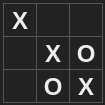
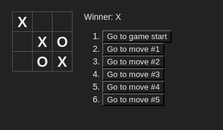

<h1 align="center">
    
</h1>

<h1 align="center">

❌  <a href="#"> Tic-Tac-Toe </a> ⭕
</h1>

<h3 align="center">
Tic-Tac-Toe game
</h3>

<p align="center">
  

  

  <a href="https://github.com/arubesu/tictactoe/commits/master">
    
  </a>
    

   
</p>


<p align="center">
 <a href="#about">About</a> •
 <a href="#layout">Layout</a> •
 <a href="#pre-requisites"> Pre requisites</a> •
 <a href="#tech-stack">Tech Stack</a> •
 <a href="#author">Author</a> •
 <a href="#license">License</a>

</p>


## About

🔎 Tic-tac-toe is a paper-and-pencil game for two players, X and O, who take turns marking the spaces in a 3×3 grid. The player who succeeds in placing three of their marks in a diagonal, horizontal, or vertical row is the winner. It is a solved game with a forced draw assuming best play from both players. 

Project developed following [React docs](https://reactjs.org/tutorial/tutorial.html).

---

## Layout

<p align="center" style="display: flex; align-items: flex-start; justify-content: center;">
 

</p>

---

## Pre-requisites

Before you begin, you will need to have the following tools installed on your machine:
[Git] (https://git-scm.com), [Node.js] (https://nodejs.org/en/).
In addition, it is good to have an editor to work with the code like [VSCode] (https://code.visualstudio.com/)

#### Running the web application

```bash

# Clone this repository
$ git clone git@github.com:arubesu/tictactoe.git

# Access the project folder cmd/terminal
$ cd tictactoe

# install the dependencies
$ npm install

# Run the application in development mode
$ npm start

# The application will start at port: 3000 - go to http://localhost:3000

```
---

## Tech Stack

The following tools were used in the construction of the project:

#### **Game**  ([React](https://reactjs.org/) ) 

-   **[React Dom](https://pt-br.reactjs.org/docs/react-dom.html)**

> See the file  [package.json](https://github.com/arubesu/tictactoe/blob/master/package.json)

## How to contribute

1. Fork the project.
2. Create a new branch with your changes: `git checkout -b my-feature`
3. Save your changes and create a commit message telling you what you did: `git commit -m" feature: My new feature "`
4. Submit your changes: `git push origin my-feature`
> If you have any questions check this [guide on how to contribute](https://github.com/firstcontributions/first-contributions)

---

## Author

 
 <br />

 [](https://www.linkedin.com/in/bruno-a-souza/)
---

## License

This project is under the license [MIT](./LICENSE).

Made with ❤️  by Bruno Souza 👋🏽 [Get in Touch!](https://www.linkedin.com/in/bruno-a-souza/)
